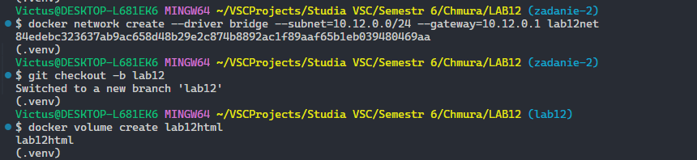
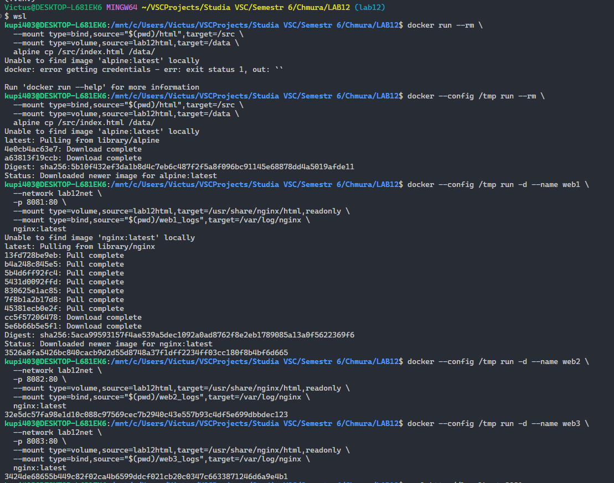
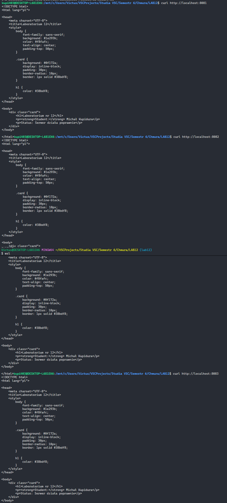
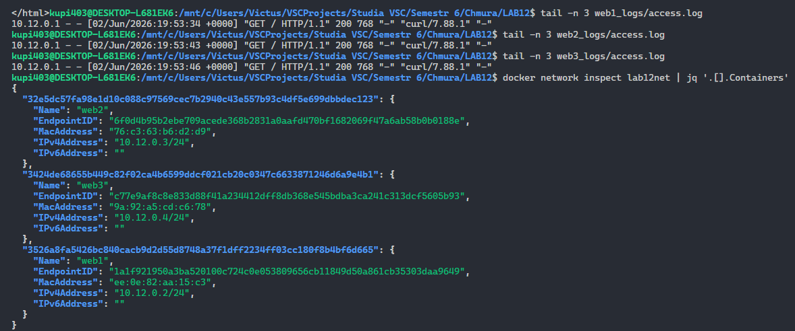
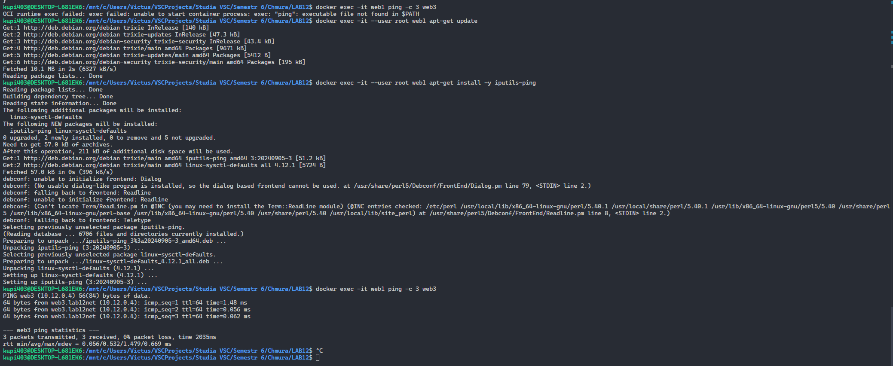

# Sprawozdanie z Laboratorium nr 12
**Temat:** Realizacja połączeń sieciowych i wolumenów w środowisku Docker


## 1. Cel zadania
Celem ćwiczenia było uruchomienie trzech niezależnych serwerów WWW (Nginx) podłączonych do wydzielonej, zdefiniowanej przez użytkownika sieci mostkowej (User-defined bridge). Projekt wymagał zapewnienia persystencji logów serwerów na dysku maszyny macierzystej (hosta) za pomocą mechanizmu Bind Mount oraz bezpiecznego udostępnienia wspólnego kodu strony HTML w trybie Read-Only.


## 2. Architektura środowiska laboratoryjnego
Zaimplementowane środowisko składa się z następujących komponentów chmurowych:
* **Sieć:** `lab12net` – dedykowany most sieciowy w podsieci `10.12.0.0/24` z bramą domyślną `10.12.0.1`.
* **Wolumen danych wspólnych:** `lab12html` – zarządzany wolumen Dockera (Named Volume) przechowujący plik statyczny `index.html`.
* **Kontenery:** Trzy instancje `nginx:latest` o nazwach `web1`, `web2`, `web3` z mapowaniem portów odpowiednio na `8081`, `8082` i `8083` hosta.
* **Persystencja logów:** Trzy niezależne punkty montowania typu bind, przekierowujące ścieżkę `/var/log/nginx` z kontenerów do fizycznych katalogów w systemie macierzystym (`web1_logs/`, `web2_logs/`, `web3_logs/`).


## 3. Polecenia

### 3.1. Przygotowanie struktury katalogów i pliku źródłowego
W katalogu roboczym utworzono strukturę dla logów oraz podkatalog `html`, w którym umieszczono plik `index.html`:

```html
<!DOCTYPE html>
<html lang="pl">

<head>
    <meta charset="UTF-8">
    <title>Laboratorium 12</title>
    <style>
        body {
            font-family: sans-serif;
            background: #1e293b;
            color: #f8fafc;
            text-align: center;
            padding-top: 50px;
        }

        .card {
            background: #0f172a;
            display: inline-block;
            padding: 30px;
            border-radius: 10px;
            border: 1px solid #38bdf8;
        }

        h1 {
            color: #38bdf8;
        }
    </style>
</head>

<body>
    <div class="card">
        <h1>Laboratorium nr 12</h1>
        <p><strong>Student:</strong> Michał Kupidura</p>
        <p>Status: Serwer działa poprawnie</p>
    </div>
</body>

</html>
```

W pierwszym etapie w lokalnym katalogu roboczym utworzono strukturę podkatalogów przeznaczonych na logi systemowe poszczególnych serwerów, czyli foldery web1_logs, web2_logs oraz web3_logs, a także dodatkowy katalog o nazwie html. Wewnątrz katalogu html utworzono plik index.html zawierający strukturę dokumentu z numerem laboratorium, stylem CSS oraz imieniem i nazwiskiem studenta. Następnie utworzono dedykowaną sieć mostkową lab12net z określeniem stałej podsieci 10.12.0.0/24 i bramy domyślnej 10.12.0.1, co pozwala na pełną kontrolę nad wewnętrzną adresacją IPAM oraz izolację ruchu sieciowego. Do zarządzania wspólnym kodem źródłowym strony wykorzystano wolumen nazwany lab12html, który zainicjalizowano przygotowanym plikiem konfiguracyjnym za pomocą tymczasowego kontenera opartego na dystrybucji Alpine Linux.



Uruchomienie trzech produkcyjnych kontenerów o nazwach web1, web2 oraz web3 zrealizowano przy użyciu zalecanej składni z flagą mount. Pozwoliło to na bezpieczne podczenie wspólnego wolumenu lab12html pod ścieżkę serwowania plików Nginx z jednoznacznym przypisaniem atrybutu read-only, co uniemożliwia modyfikację kodu strony od środka kontenera. Jednocześnie logi każdego z serwerów zostały skierowane do dedykowanych folderów na komputerze hosta poprzez punkty montowania typu bind mount powiązane ze ścieżką var log nginx w kontenerach Serwery zostały udostępnione dla sieci zewnętrznej poprzez przekierowanie portów na porty 8081, 8082 oraz 8083 maszyny macierzystej. Ze względu na środowisko WSL oraz ograniczenia uprawnień Docker Desktop, procedurę pobierania obrazów zintegrowano z tymczasowym profilem konfiguracyjnym tmp.



Poprawność działania całego systemu zweryfikowano poprzez wygenerowanie ruchu sieciowego za pomocą narzędzia curl skierowanego na poszczególne porty lokalne. Wszystkie serwery poprawnie zwróciły spersonalizowaną stronę internetową, co potwierdza, że wspólny wolumen został prawidłowo zamontowany pod ścieżkę usr share nginx html, a aplikacja działa w sposób powtarzalny na każdej z instancji.



Sprawdzenie zawartości plików w katalogach logów na dysku twardym hosta za pomocą polecenia tail wykazało, że każde zapytanie sieciowe zostało natychmiastowo i trwale zapisane w systemie macierzystym. Dodatkowo inspekcja sieci za pomocą polecenia inspect oraz filtra jq potwierdziła prawidłową alokację adresów IP wewnątrz mostu sieciowego użytkownika przez wewnętrzny moduł IPAM, gdzie web1 otrzymał adres 10.12.0.2, web2 adres 10.12.0.3, natomiast web3 adres 10.12.0.4.



Jako element rozszerzony sprawdzono działanie wewnętrznego mechanizmu odkrywania usług po nazwach, który jest kluczową zaletą sieci definiowanych przez użytkownika. W tym celu wewnątrz działającego kontenera web1 zaktualizowano pakiety systemowe i zainstalowano narzędzie iputils-ping. Wykonany test polegający na wysłaniu pakietów ICMP z kontenera web1 bezpośrednio na nazwę sieciową web3 zakończył się pełnym sukcesem. Kontener automatycznie rozwiązał nazwę domenową na adres 10.12.0.4, co dowodzi obecności wbudowanego serwera DNS w sieci mostkowej Dockera i stanowi ostateczne potwierdzenie prawidłowej konfiguracji całego środowiska sieciowego.

