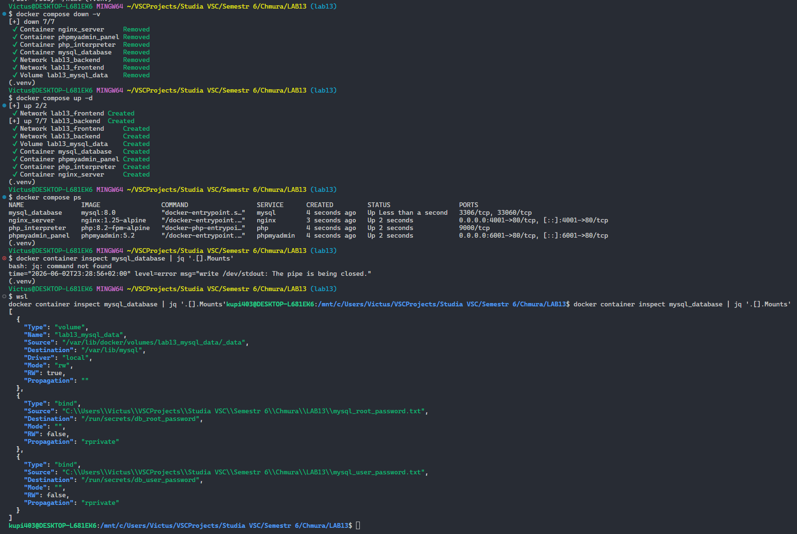
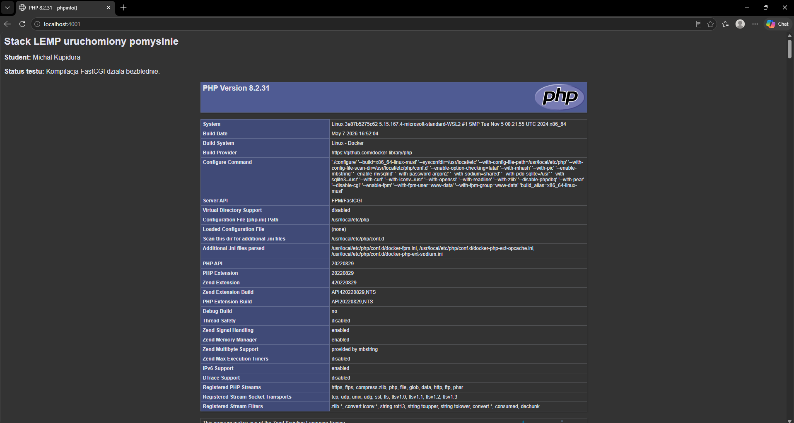
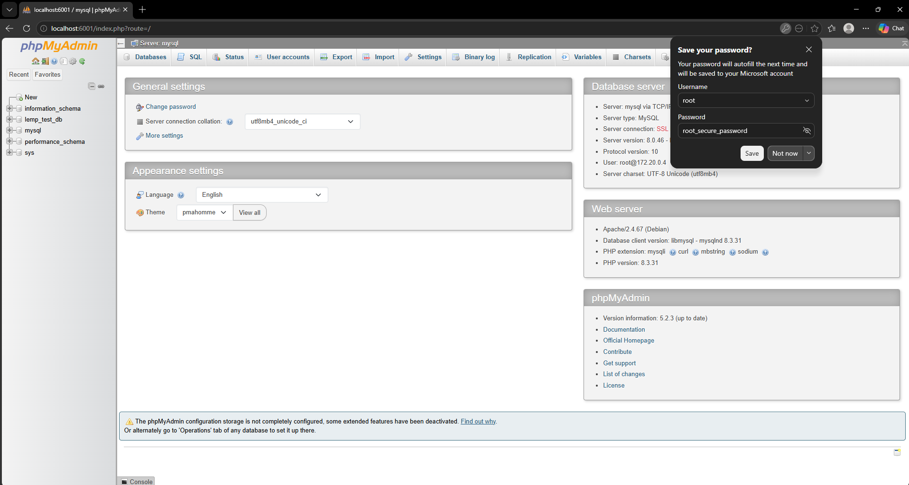

# Sprawozdanie z Laboratorium nr 13 oraz 13D

**Temat:** Architektura wielokontenerowa Docker Compose oraz zarządzanie danymi wrażliwymi (Docker Secrets)
**Autor:** Michał Kupidura

---

## 1. Cel laboratorium

Głównym celem zrealizowanego projektu było wdrożenie i optymalizacja wielokontenerowej aplikacji w architekturze mikrousługowej z wykorzystaniem narzędzia **Docker Compose**W ramach ćwiczenia wdrożono stack **LEMP** (Nginx, PHP-FPM, MySQL) zintegrowany z graficznym panelem zarządzania **phpMyAdmin**.

Dodatkowym, kluczowym celem (zgodnie z wytycznymi laboratorium 13D) było pełne zabezpieczenie danych poufnych poprzez eliminację jawnych haseł z plików konfiguracyjnych i zastąpienie ich mechanizmem **Docker Secrets**.

---

## 2. Architektura i segmentacja sieciowa środowiska

Aplikacja została podzielona na odseparowane segmenty sieciowe w celu zapewnienia maksymalnej izolacji oraz zgodności z regułami bezpieczeństwa Cloud-Native:

**\*Sieć `frontend`:** Odpowiada za komunikację z zewnętrznym światem oraz przyjmowanie żądań użytkowników. Do tej sieci podłączone są wyłącznie kontenery proxy (`nginx`) oraz interfejsu graficznego (`phpmyadmin`).

- **Sieć `backend`:** Odizolowany segment sieciowy, do którego podłączone są bazy danych (`mysql`) oraz silnik wykonawczy (`php`). Kontener MySQL nie posiada bezpośredniego dostępu do sieci zewnętrznej, co uniemożliwia bezpośrednie ataki z zewnątrz.
- **Persystencja danych (`mysql_data`):** Zarządzany wolumen Dockera (Named Volume) gwarantujący trwałość relacyjnej bazy danych na dysku hosta, niezależnie od cyklu życia samych kontenerów.

---

## 3. Wykaz wdrożonych plików konfiguracyjnych

### 3.1. Plik definicji środowiska: `docker-compose.yaml`

Poniższy plik definiuje relacje między usługami, limity sieciowe, punkty montowania wolumenów oraz implementuje mechanizm bezpiecznej dystrybucji sekretów bezpośrednio z plików tekstowych:

```yaml
services:
  nginx:
    image: nginx:1.25-alpine
    container_name: nginx_server
    restart: unless-stopped
    ports:
      - '4001:80'
    volumes:
      - ./html:/var/www/html
      - ./nginx/default.conf:/etc/nginx/conf.d/default.conf:ro
    networks:
      - frontend
      - backend
    depends_on:
      - php

  php:
    image: php:8.2-fpm-alpine
    container_name: php_interpreter
    restart: unless-stopped
    volumes:
      - ./html:/var/www/html
    networks:
      - backend
    depends_on:
      - mysql

  mysql:
    image: mysql:8.0
    container_name: mysql_database
    restart: unless-stopped
    environment:
      MYSQL_ROOT_PASSWORD_FILE: /run/secrets/db_root_password
      MYSQL_DATABASE: lemp_test_db
      MYSQL_USER: lemp_user
      MYSQL_PASSWORD_FILE: /run/secrets/db_user_password
    secrets:
      - db_root_password
      - db_user_password
    volumes:
      - mysql_data:/var/lib/mysql
    networks:
      - backend

  phpmyadmin:
    image: phpmyadmin:5.2
    container_name: phpmyadmin_panel
    restart: unless-stopped
    ports:
      - '6001:80'
    environment:
      PMA_HOST: mysql
      # Problem z phpmyadmin:5.2 - celowo jest tylko PMA_HOST, bo zapobiega pętli błędu 'Access denied' przy parsowaniu sekretów przez Windows/Docker Desktop i wymusza formularz.
    networks:
      - frontend
      - backend
    depends_on:
      - mysql

volumes:
  mysql_data:

networks:
  frontend:
    driver: bridge
  backend:
    driver: bridge

secrets:
  db_root_password:
    file: ./mysql_root_password.txt
  db_user_password:
    file: ./mysql_user_password.txt
```

## 4. Potwierdzenie

### 4.1 Potwierdzenie uruchomienia i statusu oraz użycie secrets.



### 4.2 Test działania stacku LEMP i FastCGI.



### 4.3 Test bazy danych w phpMyAdmin.


